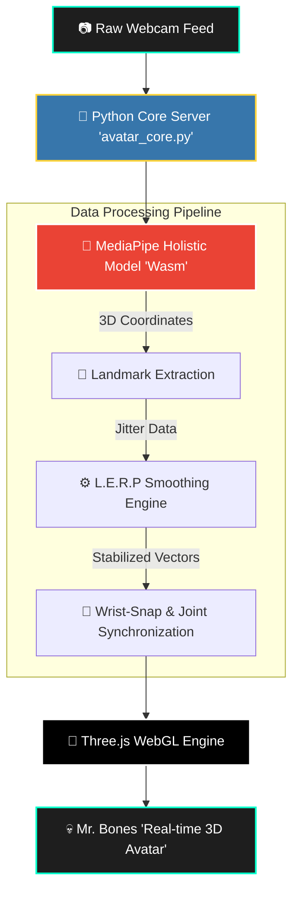

<div align="center">
    

    
# 👁️‍🗨️ Project A.V.A.T.A.R 
**Advanced Virtual Augmentation & Tracking Response**

[](https://www.python.org/)
[](https://threejs.org/)
[](https://mediapipe.dev/)
[](#)

*They track 2D pixels, we build 3D realities.* <br>
*A real-time 3D kinematic simulation mapping human biology directly to a digital rig ("Mr. Bones").*

</div>

---

## 🚀 System Overview
**Project A.V.A.T.A.R** is an Edge-AI driven Computer Vision pipeline. Instead of relying on traditional, synchronous Python-OpenCV threads (which suffer from rendering lag), this architecture utilizes a **Python Backend Server** to host a highly optimized **Wasm (WebAssembly)** edge-computing environment. 

This enables **60FPS fluid motion mapping** directly on the client GPU, bypassing standard hardware limitations.

---

## 🧠 Neural Architecture & Data Flow (Flowchart)



## ⚙️ Core Engineering Modules

### 1. Generative Code Synthesis & Hybrid Engine 💻

Built utilizing AI-Augmented rapid prototyping, separating the heavy 3D rendering (WebGL) from the server logic (Python).

### 2. Kinematic Smoothing (LERP Algorithm) 📉

Raw camera data has micro-jitters. The system applies **Linear Interpolation (LERP)** to predict and smooth out the distance between the current frame and the target coordinates, making "Mr. Bones" move like a fluid digital twin.

### 3. Anatomical Snapping (Z-Axis Correction) 🎯

Independent hand models (fingers) are algorithmically fused to the arm joints in 3D Euclidean space. The wrist coordinate $(x, y, z)$ of the hand perfectly syncs with the wrist coordinate of the body posture.

-----

## 🛠️ Installation & Execution

To run the simulation locally on your machine:

**1. Clone the repository:**

```bash
git clone [https://github.com/CODERUDRA-X/Project-AVATAR.git](https://github.com/CODERUDRA-X/Project-AVATAR.git)
cd Project-AVATAR
```

**2. Initialize the Python Neural Server:**

```bash
python avatar_core.py
```

**3. System Boot:**
The Python script will automatically map the local ports, establish the environment, and launch the 3D visualizer in your default browser. *Ensure camera permissions are granted for Neural Tracking.*

-----

<div align="center">
<p><b>Created for the Future. Designed for the Edge.</b></p>
<i>#AiTrends2026 #FutureTech #ComputerVision #ProjectAvatar</i>
</div>

```

